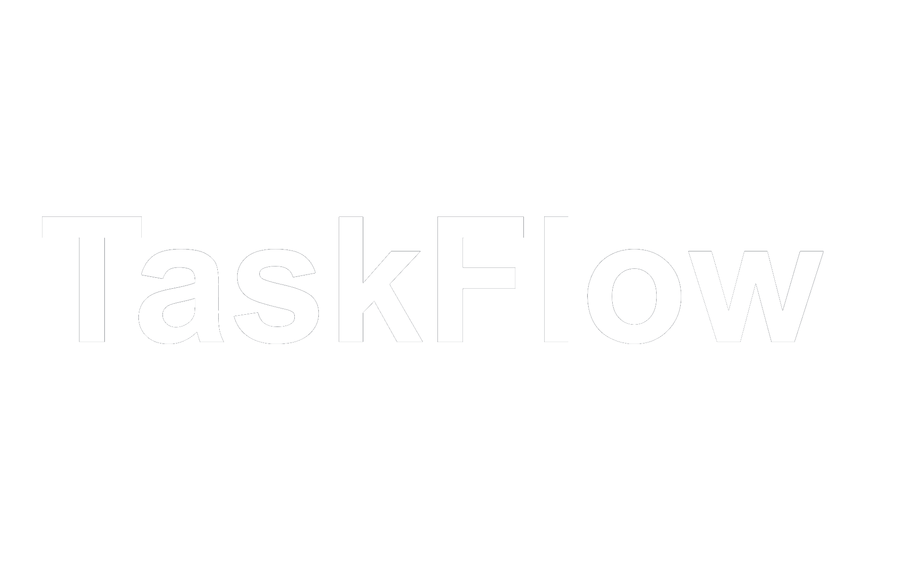

<div id="top"></div>

<!-- PROJECT SHIELDS -->
[![Contributors][contributors-shield]][contributors-url]
[![Forks][forks-shield]][forks-url]
[![Stargazers][stars-shield]][stars-url]
[![Issues][issues-shield]][issues-url]
[![MIT License][license-shield]][license-url]

<!-- PROJECT LOGO -->
<br />
<div align="center">
  <a href="https://github.com/Bearded-Viking/TaskFlow/">
    
  </a>

  <h3 align="center">TaskFlow - The Web-Based Task Manager</h3>
  
  <hr>
  
  <p align="center">
    The simplistic, no-nonsense, Work Flow Manager you never knew you needed.
    <br />
    <a href="https://github.com/Bearded-Viking/TaskFlow/"><strong>View Source Code »</strong></a>
    <br />
    <br />
    <a href="https://github.com/Bearded-Viking/TaskFlow/issues">Report Bug</a>
    ·
    <a href="https://github.com/Bearded-Viking/TaskFlow/issues">Request Feature</a>
  </p>
</div>


<!-- TABLE OF CONTENTS -->
<details>
  <summary>Table of Contents</summary>
  <ol>
    <li>
      <a href="#about-the-project">About The Project</a>
      <ul>
        <li><a href="#built-with">Built With</a></li>
      </ul>
    </li>
    <li>
      <a href="#getting-started">Getting Started</a>
      <ul>
        <li><a href="#prerequisites">Prerequisites</a></li>
        <li><a href="#installation">Installation</a></li>
        <li><a href="#running-taskflow">Running TaskFlow</a></li>
      </ul>
    </li>
    <li><a href="#the-basics-of-taskflow">The Basics of TaskFlow</a></li>
    <ul>
        <li><a href="#registration">Registration</a></li>
        <li><a href="#adding-tasks">Adding Tasks</a></li>
        <li><a href="#the-main-view">The Main View</a></li>
        <li><a href="#viewing-task-details">Viewing Task Details</a></li>
        <li><a href="#deleting-tasks">Deleting Tasks</a></li>
        <li><a href="#logging-out">Logging Out</a></li>
        <li><a href="#logging-in">Logging In</a></li>
    </ul>
    <li><a href="#roadmap">Roadmap</a></li>
    <li><a href="#contributing">Contributing</a></li>
    <li><a href="#license">License</a></li>
    <li><a href="#acknowledgments">Acknowledgments</a></li>
  </ol>
</details>


<!-- ABOUT THE PROJECT -->
## About The Project

There are many to-do lists available on GitHub - possibly even more than the amount of django-based websites; however, this is mine. I wanted to create something simple, functional and aesthetic - and it seems that this is what my efforts have amounted to.

Features:
* Add tasks to your to-do list; Ensuring you won't forget about one along the way.
* Remove accomplished tasks; Remove clutter from your workflow
* Add and view details; Including the date and time tasks were uploaded.
* Edit tasks; Because details tend to change - even if the main idea stays the same.
* Filter tasks; With so much on your plate, you really don't have to scroll through all of them in search of the task you need - urgently.
* User authentication; Login is required to access any non-login site, script kiddies aren't going to mess with your day!
* Simplicity is key; We live with enough distractions and adds - use an application that drops the unnecessary and helps you with your necessities.

<p align="right">(<a href="#top">back to top</a>)</p>


### Built With

This section should list any major frameworks/libraries used to bootstrap your project. Leave any add-ons/plugins for the acknowledgements section. Here are a few examples.

* [Django 4.0.3](https://www.djangoproject.com/)
* [Python 3.10.4](https://www.python.org/)
* [SQL Lite 3](https://sqlite.org/index.html)
* [Google Fonts](https://fonts.google.com/)
* HTML
* CSS

<p align="right">(<a href="#top">back to top</a>)</p>


<!-- GETTING STARTED -->
## Getting Started

Setting up TaskFlow on your local machine might sound daugnting, but not to fear - as long as README is here!
Simply execute these simple steps, as you would on your to-do list.

### Prerequisites

You'll need Python 3.8 or higher, as well as Django 4.0 or newer for the application to run smoothly.
A virtual environment is not necessary, but advised. Therefore we'll cover its installation as well.
Not installed? No worries, all you need is an internet connection.

Downloading the lastest version of Python:
* Click [here](https://www.python.org/downloads/) to navigate to python's official page.
* Click on the big, round "Download Python [version]" button.
* Save the executable file.
* Open the .exe file within the downloaded location, and follow the installation instructions.

Downloading VirtualEnv (recommended):
* Open the terminal / command prompt
  * On PC: Open Command prompt by pressing start, then typing "cmd" then hit ENTER.
  * On Mac OS: Click the Launchpad icon in the Dock, type Terminal in the search field, then click Terminal.
* Type the following command to install VirtualEnv:
  ```sh
  pip install virtualenv
  ```

Downloading the lastest version of Django:
* Open the terminal / command prompt (only if not already open)
  * On PC: Open Command prompt by pressing start, then typing "cmd" then hit ENTER.
  * On Mac OS: Click the Launchpad icon in the Dock, type Terminal in the search field, then click Terminal.
* Type the following command:
  ```sh
  pip install django
  ```


### Installation

1. Navigate to the directory you would like to install TaskFlow:
  ```sh
  cd [DirectoryPathHere]
  ```
2. Clone the repository by entering the following command into your shell:
   ```sh
   git clone https://github.com/Bearded-Viking/TaskFlow.git
   ```
3. Create a virutal environment by entetering the following command:
  ```sh
  virtualenv taskFlowEnv
  ```
4. Activate the virutal environment by entetering this command:
  ```sh
  taskFlowEnv\script\activate
  ```
5. Lastly, Make migrations with this command:
  ```sh
  taskFlowEnv\script\activate
  ```

### Running TaskFlow

* Finally, we can run the server with this command:
  ```sh
  python manage.py runserver
  ```
* Click [Here](http://127.0.0.1:8000/) or head to one of the following sites:
  ```sh
  http://127.0.0.1:8000/
  ```
  ```sh
  localhost:8000/
  ```

<p align="right">(<a href="#top">back to top</a>)</p>


<!-- USAGE EXAMPLES -->
## The Basics of TaskFlow

### Registration
[![TaskFlow Registration][screenshot-registration]](https://github.com/Bearded-Viking/TaskFlow/blob/main/images/screenshotRegistration.png)
If this is your first time using TaskFlow, you will automatically be redirected to the Registration page.
Enter a username as well as a password that satisfies the minimum requirements.

[![TaskFlow Empty List][screenshot-emptyList]](https://github.com/Bearded-Viking/TaskFlow/blob/main/images/screenshotEmptyList.png)
No, you're not on vacation, you just haven't uploaded any tasks yet.

### Add Tasks

Click on Add Tasks and fill in the task's title and a description thereof.
The description isn't necessary, but could greatly help with more complex tasks - such as buying groceries.
[![TaskFlow Add Task][screenshot-addTask]](https://github.com/Bearded-Viking/TaskFlow/blob/main/images/screenshotAddTask.png)
Click on the "Add Task" button to have it added to your list.

### The Main View

[![TaskFlow List][screenshot-list]](https://github.com/Bearded-Viking/TaskFlow/blob/main/images/screenshotList.png)
This is your very own list. Don't worry, no other user is able to view or manipulate it - only you can.

### Viewing Task Details
If you've forgotton the minuce of a task, but remembered to add the details of it, you can click on "View Details" to help yourself out.
[![TaskFlow Details][screenshot-details]](https://github.com/Bearded-Viking/TaskFlow/blob/main/images/screenshotDetails.png)

### Deleting Tasks
From the main view, you can also click on "Delete" on an item to remove it.
This will open a confirmation screen. Remember: If you delete it, we can't bring it back - so please be sure before confirming.
[![TaskFlow Delete][screenshot-delete]](https://github.com/Bearded-Viking/TaskFlow/blob/main/images/screenshotDelete.png)

### Logging Out
If you click on "Logout", it would do just that. What a surprise!

### Logging In
[![TaskFlow Login][screenshot-login]](https://github.com/Bearded-Viking/TaskFlow/blob/main/images/screenshotLogin.png)
When you're good and ready, you can log back in to view your goals, then go crush them one-by-one.

<p align="right">(<a href="#top">back to top</a>)</p>


<!-- ROADMAP -->
## Roadmap

- [x] Add Edit Task Mode
- [x] Add back to top links
- [] Add Light Mode
- [] Multi-language Support
    - [] Deutsch
    - [] Français
    - [] Português

See the [open issues](https://github.com/othneildrew/Best-README-Template/issues) for a full list of proposed features (and known issues).

<p align="right">(<a href="#top">back to top</a>)</p>


<!-- CONTRIBUTING -->
## Contributing

Contributions are what make the open source community such an amazing place to learn, inspire, and create. Any contributions you make are **greatly appreciated**.

If you have a suggestion that would make this better, please fork the repo and create a pull request. You can also simply open an issue with the tag "enhancement".
Don't forget to give the project a star! Thanks again!

1. Fork the Project
2. Create your Feature Branch (`git checkout -b feature/AmazingFeature`)
3. Commit your Changes (`git commit -m 'Add some AmazingFeature'`)
4. Push to the Branch (`git push origin feature/AmazingFeature`)
5. Open a Pull Request

<p align="right">(<a href="#top">back to top</a>)</p>


<!-- LICENSE -->
## License

Distributed under the MIT License. See `LICENSE.txt` for more information.

<p align="right">(<a href="#top">back to top</a>)</p>


<!-- ACKNOWLEDGMENTS -->
## Acknowledgments
I'd also like to acknowledge and recommend these resources that made the creation of this project significantly easier to tackle alone.

* [Geeks for Geeks](https://www.geeksforgeeks.org/)
* [freeCodeCamp](https://www.freecodecamp.org/)
* [W3 Schools](https://www.w3schools.com/)
* [Colt Steele](https://www.udemy.com/user/coltsteele/)
* [Zurik Phillips](https://github.com/zuriknet/README)

<p align="right">(<a href="#top">back to top</a>)</p>


<!-- MARKDOWN LINKS & IMAGES -->
[contributors-shield]: https://img.shields.io/github/contributors/Bearded-Viking/TaskFlow.svg?style=for-the-badge
[contributors-url]: https://github.com/Bearded-Viking/TaskFlow/graphs/contributors
[forks-shield]: https://img.shields.io/github/forks/Bearded-Viking/TaskFlow.svg?style=for-the-badge
[forks-url]: https://github.com/Bearded-Viking/TaskFlow/network/members
[stars-shield]: https://img.shields.io/github/stars/Bearded-Viking/TaskFlow.svg?style=for-the-badge
[stars-url]: https://github.com/Bearded-Viking/TaskFlow/stargazers
[issues-shield]: https://img.shields.io/github/issues/Bearded-Viking/TaskFlow.svg?style=for-the-badge
[issues-url]: https://github.com/Bearded-Viking/TaskFlow/issues
[license-shield]: https://img.shields.io/github/license/Bearded-Viking/TaskFlow.svg?style=for-the-badge
[license-url]: https://github.com/Bearded-Viking/TaskFlow/blob/master/LICENSE.txt

[screenshot-addTask]: images/screenshotAddTask.png
[screenshot-delete]: images/screenshotDelete.png
[screenshot-details]: images/screenshotDetails.png
[screenshot-emptyList]: images/screenshotEmptyList.png
[screenshot-filter]: images/screenshotFilter.png
[screenshot-list]: images/screenshotList.png
[screenshot-login]: images/screenshotLogin.png
[screenshot-registration]: images/screenshotRegistration.png
